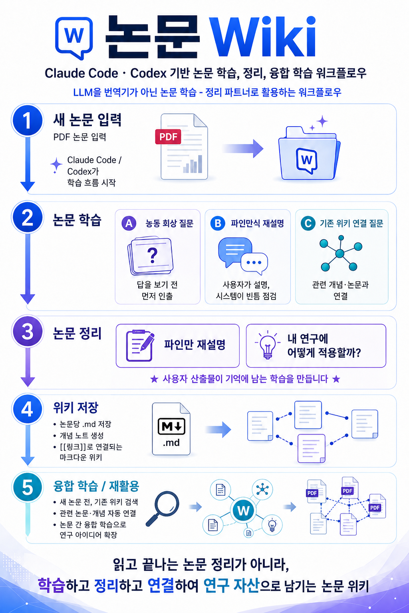

<div align="center">



# 📚 Paper Study — 논문 능동학습 위키 스킬

**읽고 끝나는 논문 정리가 아니라, 학습하고 정리하고 연결해 연구 자산으로 남기는 논문 위키**

A [Claude Code](https://claude.com/claude-code) skill that turns passive paper-reading into **active learning**.
Instead of handing you a summary, it forces *active recall*, *Feynman re-explanation*, and *connection to what you already know* — then saves it all as a linked Markdown wiki.

[설치](#-설치) · [사용법](#-사용법) · [작동 원리](#-왜-요약이-아니라-능동학습인가) · [English](#-english)

</div>

---

## 🤔 왜 "요약"이 아니라 "능동학습"인가

LLM으로 논문을 읽으면 글은 많이 읽는데 **머릿속에 남는 게 없는** 경험, 다들 있을 거예요.
원인은 **수동적 읽기(요약 받기)** 예요. 기억에 남으려면 인지과학이 말하는 세 가지가 필요합니다:

| 장치 | 무엇 | 이 스킬에서 |
|------|------|------------|
| **Active Recall** | 답을 보기 전에 스스로 인출하기 | 답을 가린 채 회상 질문을 하나씩 출제 → 먼저 답하면 채점·교정 |
| **Feynman Technique** | 쉬운 말로 직접 설명하기 | 본인 말로 재설명 → AI가 칭찬 대신 *빈틈·오개념*을 지적 |
| **Elaboration** | 기존 지식과 연결하기 | 위키를 검색해 "예전에 읽은 [[X]]와 이렇게 다르다" 연결 질문 |

그리고 핵심: **저장 전에 본인이 직접** "내 연구에 어떻게 적용할까 / 내 의견은" 을 써야 합니다.
AI가 대신 채우지 않습니다 — 그게 진짜로 기억에 남는 부분이니까요.

## 🔄 왜 "쌓기"가 아니라 "살아있는 위키"인가

논문을 하나씩 요약해 폴더에 던져두면, 지식이 **병렬로 널브러질(piling)** 뿐 서로 이어지지 않습니다.
새 논문이 예전 결론을 뒤집어도 옛 노트는 그대로고, "이 다섯 편이 함께 말하는 것"은 아무도 조립하지 않습니다.

이 스킬은 [Andrej Karpathy가 말한 **LLM wiki**](https://gist.github.com/karpathy/442a6bf555914893e9891c11519de94f)의 정신을 따릅니다 —
**질의 때마다 원문을 다시 뒤지는 RAG가 아니라, 읽을 때 한 번 종합해 두고 계속 최신으로 유지하는 "compounding artifact"**.
즉 새 논문은 *덧붙이는(append)* 게 아니라 **기존 지식체계를 갱신(reconcile)**합니다:

| 원칙 | 무엇 | 이 스킬에서 |
|------|------|------------|
| **Update-in-place** | 새 소스가 기존 페이지를 제자리 갱신 | 저장 직후(6.7 리컨실 패스) 이 논문이 건드린 개념·논문 노트의 본문을 다시 씀 (백링크만 X) |
| **Contradiction flagging** | 모순을 숨기지 않고 표시 | 새 논문 ↔ 기존 노트·내 의견이 어긋나면 **양쪽에 `⚠️ 모순: [[..]]`** + 즉시 보고 |
| **Supersede / living synthesis** | 뒤집힌 주장은 폐기 표시, 개념은 계속 성장 | 프론트매터 `superseded_by`/`supersedes`/`contradicts`, 종합 모드로 `moc/`에 대조·공백 축적 |

> 개념 페이지는 **살아있는 합의문**입니다. 논문이 늘수록 정의가 더 정확해지거나 모순이 명시적으로 드러나야 하고,
> 그대로 멈춰 있다면 리컨실을 안 한 것입니다. — 이것이 이 위키가 *읽고 버리는 폴더*와 다른 지점입니다.

## ✨ 기능

- 🧩 **6가지 모드** — 학습 / 이어하기 / 복습 / 연결 조회 / 위키 질문 / **종합·인사이트**
- 📖 **통독 vs 섹션별 정독** 선택 — 정독 모드는 섹션마다 번역본 → 읽기 → 섹션 퀴즈
- 🔗 **마크다운 위키** — 논문·개념 노트를 `[[위키링크]]`로 양방향 연결 (Obsidian 호환)
- 🩹 **링크 무결성 자동화** — 저장할 때마다 깨진 링크 탐지 → 없는 개념 스텁 자동 생성 → 역링크 보강 → 인덱스 동기화
- 🔄 **지식 리컨실(reconciliation)** — 새 논문이 들어오면 기존 개념·논문 노트를 **제자리 갱신**하고, 어긋나는 주장은 `⚠️ 모순`으로 양쪽에 표시(`superseded_by`/`contradicts` 기록). *덧붙이기가 아니라 지식체계 업데이트* (Karpathy LLM wiki 정신)
- 🧠 **종합·인사이트 모드** — 여러 논문을 가로질러 **대조표·모순·문헌 공백**을 생성하고, 그 결과를 다시 능동 회상으로 되던짐 (`moc/`에 종합 노트로 축적)
- ⏸️ **중단 & 이어하기** — 여러 날에 걸친 학습을 체크포인트로 재개
- 🔁 **간격 반복** — 약했던 문제를 다음 복습 때 우선 재출제
- 🌐 **새 논문이 들어오면** 위키를 먼저 검색해 관련 연구를 제시

## 🧠 권장 모델

이 스킬은 논문 독해, **오개념 지적**, 기존 지식과의 **연결 추론** 등 고차원 사고를 많이 요구합니다.
경량 모델은 회상 채점이 헐겁거나 오개념을 놓칠 수 있어 학습 효과가 떨어집니다.

- ✅ **권장**: **Claude Opus** (Claude Code) 또는 **GPT-5.5 이상** (Codex 등 호환 도구)
- 🆗 동작은 하지만 깊이가 떨어질 수 있음: Claude Sonnet, GPT-4 계열 등 경량 모델

> 홍보 이미지처럼 이 스킬은 **Claude Code · Codex** 양쪽에서 쓸 수 있게 설계됐습니다.
> 채점·교정의 정확도가 곧 학습의 질이므로, 가능하면 가장 강력한 모델을 쓰는 걸 추천합니다.

## 📦 설치

> 필요: [Claude Code](https://docs.claude.com/en/docs/claude-code) · 권장 모델 **Claude Opus / GPT-5.5+**

### 방법 1 — 개인 스킬 (어디서나 사용)
```bash
git clone https://github.com/keras9496/paper-wiki.git
# paper-study 폴더를 개인 스킬 경로로 복사
cp -r paper-wiki/paper-study ~/.claude/skills/paper-study
```

### 방법 2 — 프로젝트 스킬 (위키 폴더 안에 함께 보관, 추천)
논문 위키로 쓸 폴더를 하나 만들고, 그 안 `.claude/skills/`에 넣으세요. 스킬과 위키가 한 폴더에 묶여 이동·백업이 쉽습니다.
```bash
mkdir my-paper-wiki && cd my-paper-wiki
mkdir -p .claude/skills papers concepts inbox
git clone https://github.com/keras9496/paper-wiki.git /tmp/ps
cp -r /tmp/ps/paper-study .claude/skills/paper-study
```

설치 후 위키 루트에 다음 폴더를 둡니다(없으면 스킬이 안내):
```
my-paper-wiki/
├── index.md      # 위키 홈 (논문 목록·개념 인덱스·종합 MOC)
├── papers/       # 논문당 .md 노트
├── concepts/     # 개념 원자 노트
├── moc/          # 종합 노트 (여러 논문 대조·모순·공백)
├── inbox/        # 아직 안 읽은 PDF
└── .claude/skills/paper-study/
```

## 🚀 사용법

위키 폴더에서 Claude Code를 열고:

```text
# 새 논문 학습 — PDF를 inbox/에 넣고
"이 논문 공부하자"

# 이어하기 — 며칠에 걸친 정독
"그 논문 Results부터 이어서 공부하자"

# 복습 — 인출 다시
"[[2025-어쩌고]] 복습하자"

# 위키 질문
"내가 역인과(reverse causality)에 대해 뭘 읽었더라?"

# 종합·인사이트 — 논문이 쌓이면
"이 주제 종합해줘 / 논문들 충돌하는 거 있어?"
```

스킬은 이렇게 진행합니다:
1. PDF를 읽고, 위키에서 **관련된 기존 노트를 먼저** 찾아 연결
2. **통독 / 섹션별 정독** 중 선택 (정독은 섹션마다 번역 → 퀴즈)
3. **회상 질문**을 답 가린 채 하나씩 → 직접 답하면 채점·교정
4. **파인만 재설명** → 빈틈 지적
5. 끝에 **본인이 직접** 파인만 정리 + 연구 적용 + 의견 작성
6. `papers/`에 노트 저장 + 개념 노트 + **양방향 [[링크]]** + 인덱스 갱신 + **링크 무결성 패스** + **지식 리컨실 패스**(기존 노트 제자리 갱신·모순 ⚠️ 표시)
7. 논문이 쌓이면 **종합 모드**로 대조표·모순·문헌 공백을 만들어 `moc/`에 인사이트로 축적

## 📂 무엇이 들어있나

```
paper-study/
├── SKILL.md                 # 스킬 본체 (워크플로우 전체)
└── templates/
    ├── paper.md             # 논문 노트 템플릿
    └── concept.md           # 개념 노트 템플릿
```

## 🛠 커스터마이즈

- **언어**: 번역·질문이 한국어로 설정돼 있어요. `SKILL.md`에서 다른 언어로 바꿀 수 있습니다.
- **노트 형식**: `templates/`의 프론트매터·섹션을 본인 워크플로우에 맞게 수정하세요.
- **간격 반복**: 노트의 `next_review`·`review_weak_spots` 필드를 활용해 due-card 기능으로 확장 가능.

## 🤝 기여 · 라이선스

PR·이슈 환영합니다. MIT License — 자유롭게 쓰고 고치세요.

---

## 🌐 English

> **Paper Study — an active-learning paper wiki skill.**
> Not a place where papers go to die after one read, but a wiki where you *learn*, *organize*, and *connect* them into a research asset.

A [Claude Code](https://claude.com/claude-code) skill that turns passive paper-reading into **active learning**.
Instead of handing you a summary, it forces *active recall*, *Feynman re-explanation*, and *connection to what you already know* — then saves it all as a linked Markdown wiki.

### Why active learning, not summaries?

Reading papers with an LLM, you read a lot but **remember little** — because being handed a summary is *passive*. Retention needs three things from cognitive science:

| Mechanism | What | In this skill |
|-----------|------|---------------|
| **Active Recall** | Retrieve before seeing the answer | Recall questions posed one at a time with hidden answers → you answer first, then it grades & corrects |
| **Feynman Technique** | Explain it in plain words yourself | You re-explain → the AI points out *gaps & misconceptions* instead of just praising |
| **Elaboration** | Connect to what you already know | Searches your wiki and asks "how does this differ from [[X]] you read before?" |

And the key rule: **before saving, you must write yourself** *"how does this apply to my research"* and *your opinion/critique*. The AI won't fill these in for you — because that's the part that actually sticks.

### Why a *living* wiki, not a pile

Summarizing papers into a folder just makes knowledge **pile up in parallel** — nothing connects. A new paper can overturn an old conclusion while the old note sits unchanged, and "what these five papers say *together*" is never assembled.

This skill follows the spirit of [Andrej Karpathy's **LLM wiki**](https://gist.github.com/karpathy/442a6bf555914893e9891c11519de94f): **not RAG that re-digs the sources on every query, but a compounding artifact** — synthesized once on read, then kept current. A new paper doesn't *append*; it **reconciles** the existing knowledge base:

| Principle | What | In this skill |
|-----------|------|---------------|
| **Update-in-place** | A new source revises existing pages | Right after save (the 6.7 reconciliation pass) it rewrites the body of concept/paper notes this paper touched — not just a backlink |
| **Contradiction flagging** | Surface conflicts, don't hide them | When a new paper clashes with an existing note or your opinion → `⚠️ contradiction: [[..]]` on **both** sides + reported immediately |
| **Supersede / living synthesis** | Overturned claims get flagged; concepts keep growing | Frontmatter `superseded_by` / `supersedes` / `contradicts`; synthesis mode accumulates comparisons & gaps in `moc/` |

> A concept page is a **living consensus document**. As papers accumulate, its definition should get sharper or its contradictions should surface explicitly — if it sits frozen, reconciliation didn't happen. That's what separates this from a read-and-forget folder.

### Features

- 🧩 **6 modes** — Study / Resume / Review / Connect / Ask-the-wiki / **Synthesize-for-insight**
- 📖 **Whole-read vs section-by-section** — section mode gives a per-section translation → read → section quiz
- 🔗 **Markdown wiki** — papers & concept notes linked bidirectionally with `[[wikilinks]]` (Obsidian-compatible)
- 🩹 **Link-integrity automation** — every save detects dangling links → auto-creates missing concept stubs → backfills backlinks → syncs the index
- 🔄 **Knowledge reconciliation** — a new paper **updates existing concept/paper notes in-place** and flags conflicting claims with `⚠️` on both sides (recording `superseded_by`/`contradicts`). *Updates the knowledge base, not just appends* (the Karpathy LLM-wiki spirit)
- 🧠 **Synthesis / insight mode** — cut across many papers to generate a **comparison matrix, contradictions, and literature gaps**, then throw the result back as active recall (accumulated as synthesis notes in `moc/`)
- ⏸️ **Pause & resume** — continue a multi-day study from a checkpoint
- 🔁 **Spaced repetition** — your weak spots get re-asked first next time
- 🌐 **When a new paper arrives**, it searches the wiki first and surfaces related work

### Recommended models

This skill demands high-level reasoning — paper comprehension, **spotting misconceptions**, and **connecting** new work to prior knowledge. Lighter models may grade recall loosely or miss misconceptions, weakening the learning.

- ✅ **Recommended:** **Claude Opus** (Claude Code) or **GPT-5.5+** (Codex / compatible tools)
- 🆗 Works but shallower: Claude Sonnet, GPT-4-class and other lighter models

The skill is designed to run on **both Claude Code and Codex**. Since grading/correction accuracy *is* the learning quality, use the most capable model you can.

### Install

> Requires [Claude Code](https://docs.claude.com/en/docs/claude-code). Recommended model: **Claude Opus / GPT-5.5+**.

**Personal skill (use anywhere):**
```bash
git clone https://github.com/keras9496/paper-wiki.git
cp -r paper-wiki/paper-study ~/.claude/skills/paper-study
```

**Project skill (keep skill + wiki together, recommended):**
```bash
mkdir my-paper-wiki && cd my-paper-wiki
mkdir -p .claude/skills papers concepts inbox
git clone https://github.com/keras9496/paper-wiki.git /tmp/ps
cp -r /tmp/ps/paper-study .claude/skills/paper-study
```

Your wiki root should contain these folders (the skill will guide you if missing):
```
my-paper-wiki/
├── index.md      # wiki home (paper list, concept index & synthesis MOC)
├── papers/       # one .md note per paper
├── concepts/     # atomic concept notes
├── moc/          # synthesis notes (cross-paper comparison, contradictions, gaps)
├── inbox/        # PDFs not yet read
└── .claude/skills/paper-study/
```

### Usage

Open Claude Code in your wiki folder and say:

```text
# Study a new paper — drop a PDF in inbox/
"study this paper"

# Resume — multi-day section reading
"resume studying that paper from Results"

# Review — retrieve again
"quiz me on [[2025-something]]"

# Ask the wiki
"what have I read about reverse causality?"

# Synthesize — once papers pile up
"synthesize this topic / do any of these papers conflict?"
```

What the skill does:
1. Reads the PDF and **searches your wiki for related notes first**, to prime connections
2. Lets you pick **whole-read vs section-by-section** (section mode = translate → quiz per section)
3. Poses **recall questions with hidden answers, one at a time** → you answer, it grades & corrects
4. **Feynman re-explanation** → it points out your gaps
5. At the end, **you write** the final re-explanation + research application + opinion
6. Saves a note to `papers/` + concept notes + **bidirectional [[links]]** + updates the index + a **link-integrity pass** + a **knowledge-reconciliation pass** (revises existing notes in-place, flags contradictions with ⚠️)
7. Once papers pile up, a **synthesis mode** builds a comparison matrix, contradictions & literature gaps into `moc/` as accumulated insight

### What's inside / Customize / License

```
paper-study/
├── SKILL.md                 # the skill (full workflow)
└── templates/
    ├── paper.md             # paper-note template
    └── concept.md           # concept-note template
```

- **Language:** translations/questions are set to Korean by default — change it in `SKILL.md`.
- **Note format:** edit the frontmatter/sections in `templates/` to fit your workflow.
- **Spaced repetition:** extend the `next_review` / `review_weak_spots` fields into a due-card flow.

PRs & issues welcome. **MIT Licensed** — use and modify freely.
