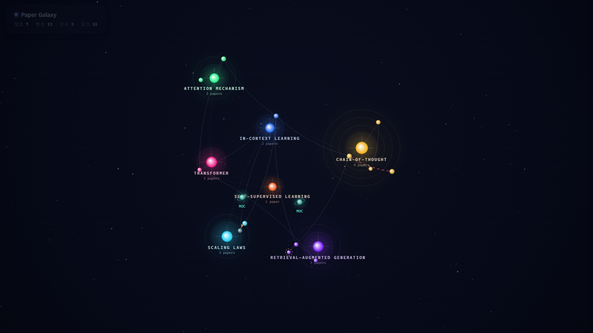

# Paper Galaxy — 논문 위키 은하 뷰

paper-study 스킬이 축적한 마크다운 위키를 **우주 온톨로지 뷰**로 시각화합니다.



## 메타포

| 위키 요소 | 우주 표현 |
|---|---|
| 개념 (`concepts/`) | **항성** — 크기 = 소속 논문 수, 항성계마다 고유 색 |
| 논문 (`papers/`) | **행성** — 주 개념 항성을 공전. 크기 = `my_rating`, 안쪽 궤도일수록 오래된 논문 |
| 종합 노트 (`moc/`) | **성운 코어** (고리 달린 청록 천체) — 종합 대상들의 무게중심에 위치 |
| `status: reading` | 호박색 점선 테두리가 깜빡이는 행성 + 점선 궤도 |
| `related_papers` | 은은한 곡선 링크 |
| `contradicts` | **붉은 점선** (흐르는 애니메이션) — 모순 관계 |
| `supersedes` | **호박색 화살표** — 폐기·승계 관계 (패널에 "폐기됨" 배지) |
| MOC ↔ 대상 | 청록 점선 (기본 숨김, MOC 호버/선택 시 표시) |

## 사용법

```bash
cd visualization

# 1) 위키를 그래프 데이터로 변환 (경로 생략 시 sample-wiki 사용)
node build-graph.mjs [위키루트경로]

# 2) 브라우저에서 열기
start galaxy.html        # Windows
```

위키루트는 `papers/`, `concepts/`, `moc/` 폴더를 가진 디렉터리면 됩니다.
`graph-data.js`가 `galaxy.html` 옆에 생성되며, `file://`로 열어도 동작합니다(빌드 필요 없음, 의존성 0).

## 조작

- **드래그** 이동 · **휠** 줌 (커서 기준)
- **의미적 줌** — 멀리서는 논문 수 상위 핵심 항성의 이름만 보이고, 줌인하거나
  항성을 클릭/호버하면 항성계가 화면에 차게 줌인되며 소속 행성(논문) 라벨이 드러납니다
- **호버** — 연결된 노드·링크만 하이라이트, 나머지는 어둡게 (툴팁에 다음 행동 안내)
- **클릭** — 우측 패널: TL;DR / 평점 / 태그 / 관계 목록(클릭 시 해당 천체로 비행) · **Esc**로 닫기
- **검색** — 제목·슬러그·태그·별칭·연도로 검색 후 해당 천체로 비행
- **토글 칩** — 관련 / 모순 / 승계 / MOC 링크 / 라벨 / 공전 on-off, 전체 보기
- **시네마** (칩 또는 `C` 키) — 카메라가 항성계를 차례로 순회하고 한 바퀴마다 전체를 조망.
  드래그·휠·클릭하면 자동 해제
- **딥링크** — 노드를 선택하면 주소가 `#/슬러그`로 바뀌어 공유·북마크·뒤로가기 가능
  (예: `galaxy.html#/2022-chinchilla-compute-optimal`, 구형 `?select=` 쿼리도 지원)
- URL에 `?nointro`를 붙이면 인트로 줌인 애니메이션을 건너뜁니다

## 학습 런처 (은하 → paper-study)

상세 패널의 **STUDY** 버튼은 paper-study 스킬용 학습 명령을 클립보드에 복사합니다.
Claude Code에 붙여넣으면 해당 모드가 바로 시작됩니다:

| 어디서 | 버튼 | 복사되는 명령 |
|---|---|---|
| 논문 (studied) | 📖 이 논문 복습하기 | 해당 노트의 능동 회상 질문 재출제·채점 (약점 우선) |
| 논문 (reading) | ⏯️ 이어서 학습 | ⏸️ 체크포인트부터 재개 + 약점 워밍업 |
| 개념 (항성) | 🪐 항성계 전체 복습 | 소속 논문 전체를 오래된 순으로 한 편씩 복습 |
| 개념 (항성) | 🔭 이 주제 종합 | 대조표·모순·공백 생성 + 능동 회상 (종합 모드) |
| MOC (성운) | 🌀 이 종합 노트 갱신 | 이후 추가된 논문을 반영해 MOC 리컨실 |

> 뷰어는 정적 HTML이라 Claude를 직접 실행하지 않습니다 — "보고 싶은 곳을 은하에서 고르고,
> 학습은 Claude Code에서"라는 분업입니다.

## 데이터 파이프라인

```
sample-wiki/*.md ──(build-graph.mjs)──▶ graph-data.js ──▶ galaxy.html
```

- `build-graph.mjs`는 프론트매터(`concepts`, `related_papers`, `supersedes`,
  `superseded_by`, `contradicts`, `papers`, `related_concepts`)와 본문 `[[위키링크]]`를
  파싱해 노드·엣지를 추출합니다. 대상 파일이 없는 링크(dangling)는 무시합니다.
- 같은 노드 쌍에 여러 관계가 있으면 강한 의미 순(승계 > 모순 > 개념 > MOC > 관련)으로 1개만 남깁니다.
- 논문의 **주 개념**(프론트매터 `concepts`의 첫 항목)이 공전할 항성을 결정하고,
  나머지 개념 링크는 점선으로 표시됩니다.

## 스케일 테스트 (논문·개념이 늘어나면?)

뷰는 데이터가 커져도 다음 장치로 버팁니다:
- **궤도 링 패킹** — 링 둘레에 비례해 한 링에 여러 행성을 배치(등간격·동일 각속도라 서로 안 겹침). 논문 20편짜리 개념도 3~4개 링에 압축됩니다.
- **라벨 최상단 패스** — 라벨은 모든 천체 위에서 반투명 백킹과 함께 그려져 행성이 지나가도 글자가 가려지지 않고, 우선순위(선택 > 호버 > 항성 > MOC > 행성) 겹침 컬링으로 밀집 시 자동으로 솎아집니다. 항성 이름은 아래가 막히면 위쪽으로 뒤집어 배치.
- **엣지 밀도 감쇠** — related 엣지가 수백 개가 되면 전체 알파를 자동으로 낮춰 스파게티화를 방지.

대량 합성 데이터로 직접 확인:

```bash
node gen-sample.mjs 90 18 stress-wiki          # 논문 90 · 개념 18 합성 (시드 고정)
node build-graph.mjs stress-wiki stress-graph.js
start "galaxy.html?data=stress-graph.js"       # ?data= 로 그래프 파일 전환
```

`gen-sample.mjs [논문수] [개념수] [폴더]` — 개념별 논문 수는 지프 분포(큰 항성계와 작은 항성계 혼재),
모순 8%·승계 6%·읽는 중 10% 비율로 관계를 심습니다. 생성물은 재생성 가능하므로 커밋하지 않습니다.

## 샘플 데이터

`sample-wiki/`는 이 기능 개발·데모용으로 만든 **가상의 학습 기록**입니다
(실제 paper-study 노트 템플릿과 동일한 스키마). LLM 연구사의 대표 논문 13편,
개념 7개, 종합 노트 2개로 구성되며, 스케일링 법칙 논쟁(Kaplan → Chinchilla 승계)과
CoT 신실성 논쟁(contradicts) 같은 관계 유형이 모두 포함되어 있습니다.
실제 위키에 연결하려면 `node build-graph.mjs <내위키경로>`로 다시 생성하면 됩니다.
